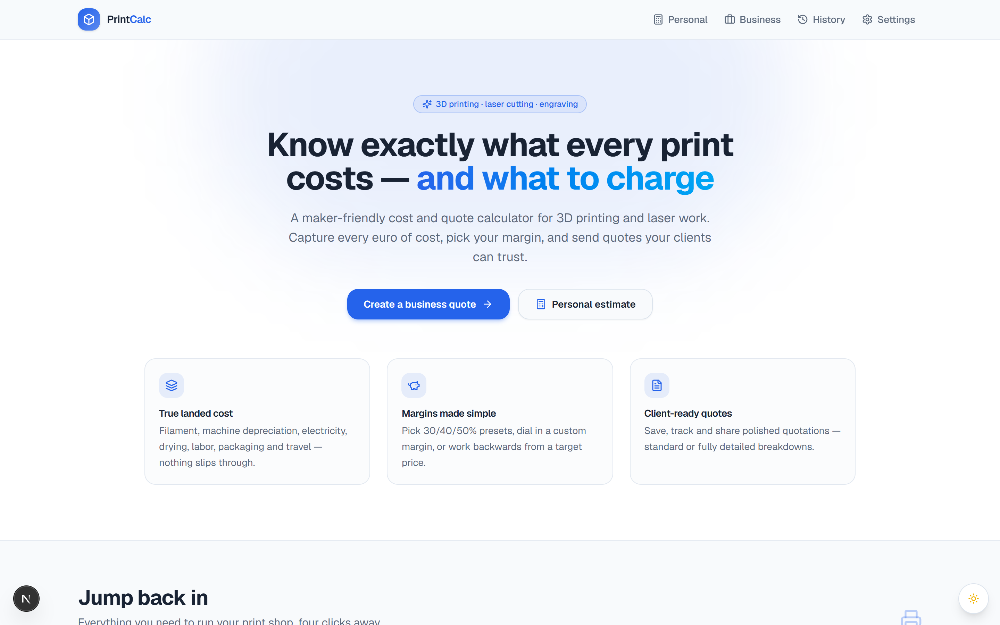

# 3D Print Cost Calculator

A self-hostable web app for pricing **3D printing, laser cutting and laser engraving** jobs. It turns your real costs — filament, machine depreciation, electricity, labour, packaging, VAT and profit margin — into consistent quotes, keeps a searchable history of everything you've quoted, and can split the books between two business owners.

> Bring your own **Supabase** project and the whole thing runs on infrastructure *you* control — there's no shared backend and no data ever flows to me. It's a plain Next.js app you can deploy to Vercel or any Node host. Every route sits behind a login screen (Supabase Auth) and Row-Level Security locks the database down to signed-in users — see [Authentication & security](#3-authentication--security).

## Why I built this

I do a fair amount of 3D printing and laser work, and *pricing* it was always the messy part. Every quote meant re-deriving the same numbers by hand — filament by the gram, machine wear, electricity, labour, packaging, then margin and VAT on top — usually in a throwaway spreadsheet that never quite matched the last one. And with two of us sharing the machines, working out who was owed what at the end of the month was its own headache.

This is the tool that replaced all of that: enter the parts, and it produces a consistent quote from costs I only configure once — then splits the profit between two owners automatically, so the books reconcile on their own. It keeps every quote, so I can look back at what a job *actually* cost to make.

## Screenshot



> The calculator, catalogue and history screens fill in once you connect your own Supabase project (see [Getting started](#getting-started)).

## Features

- **Personal & Business modes** — a quick personal cost estimate, or a full business quote with profit margin, VAT and a two-owner profit split.
- **Multi-part quotes** — combine several parts (different printers and filaments) into one quote.
- **Three calculators:**
  - **Cost calculator** — the main per-job pricing tool.
  - **Spreadsheet calculator** — Excel-style entry for many rows at once.
  - **Laser calculator** — cutting / engraving jobs priced by material and time.
- **Catalogues you manage once:**
  - **Printers** — purchase cost, expected life hours, power draw, uptime.
  - **Filaments / materials** — price per kg, type, thickness (for laser stock).
  - **Clients** — attach a customer to a quote.
  - **Global settings** — electricity rate, labour rate, emergency surcharge, …
- **Searchable quote history** with a full per-quote cost breakdown.
- **Light / dark theme**, built with Tailwind CSS and shadcn/ui.

## Cost model (in brief)

For each part the app computes:

- **Machine cost** = print hours × (printer purchase cost ÷ estimated life hours)
- **Electricity** = (printer watts ÷ 1000) × hours × electricity rate
- **Filament cost** = grams used × price-per-kg
- plus **labour**, **packaging**, **materials** and an optional **emergency surcharge**

Business quotes then add your **profit margin** and **VAT**, and split the profit (and emergency fees) between two owners. By default Owner A fronts labour, electricity and shipping while Owner B carries filament, materials, packaging and VAT, with profit divided 50/50 — all of which is [configurable](#configuration).

## Getting started

### 1. Configure Supabase

```bash
cp .env.example .env.local
```

Fill in your project URL and anon key from **Supabase → Project Settings → API**:

```
NEXT_PUBLIC_SUPABASE_URL=...
NEXT_PUBLIC_SUPABASE_ANON_KEY=...
```

### 2. Create the database

Run [`scripts/schema.sql`](scripts/schema.sql) once against your Supabase database (paste it into the Supabase SQL editor). It creates every table, seeds a couple of example printers/filaments, and **enables Row-Level Security** so only signed-in users can touch the data. It's the consolidated equivalent of the step-by-step files in [`scripts/migrations/`](scripts/migrations), which are kept only for history.

> Upgrading an existing database? Run [`scripts/rls_policies.sql`](scripts/rls_policies.sql) — it enables the same authenticated-only policies (and removes any legacy anon policy).

### 3. Authentication & security

The app requires sign-in. Next.js middleware guards every route: visitors without a Supabase session are redirected to `/login`, where they can sign in with **email + password** or request a **magic link**. A sign-out button lives in the site header.

- **Creating users:** there is no public sign-up — this is a private business tool. Create accounts in the Supabase dashboard under **Authentication → Users** ("Add user"), and share the credentials with your team. Any signed-in user sees all data (single-user/small-team model; no per-user scoping).
- **Magic links:** make sure your deployment URL is listed in Supabase under **Authentication → URL Configuration** (Site URL / Redirect URLs) so the `/auth/callback` redirect is allowed.
- **Database:** RLS grants access to the `authenticated` role only. **Anonymous access is no longer supported** — the public `anon` role has no policies, so the anon key alone (which is embedded in the browser bundle) cannot read or write anything via the Supabase REST API.

### 4. Run

```bash
pnpm install
pnpm dev
```

Open <http://localhost:3001>. *(The dev/start port is set to **3001** in `package.json` — change it there if you prefer another.)*

#### Production build

```bash
pnpm build && pnpm start
```

Deploys cleanly to Vercel or any Node host — just set the two `NEXT_PUBLIC_SUPABASE_*` variables in your host's environment.

## Configuration

The whole two-owner business model — owner labels and how profit and emergency fees are split — lives in one file: [`lib/business-config.ts`](lib/business-config.ts). Rename the owners (`OWNER_A_LABEL` / `OWNER_B_LABEL`) or change `PROFIT_SPLIT_RATIO` / `EMERGENCY_SPLIT_RATIO` there.

> The `OWNER_A_KEY` / `OWNER_B_KEY` identifiers are stored in the database. They're safe to *relabel*, but don't change the keys themselves once you have data, or existing rows stop matching.

## Tech stack

- [Next.js 16](https://nextjs.org) (App Router) + React 19 + TypeScript
- [Supabase](https://supabase.com) (Postgres) via `@supabase/ssr`
- Tailwind CSS v4 + [shadcn/ui](https://ui.shadcn.com) (Radix primitives)

## Project layout

```
app/
  page.tsx            # landing
  login/              # sign-in (email+password or magic link)
  auth/callback/      # magic-link code exchange
  personal/           # personal cost estimate
  business/           # full business quote
  quote/              # quote builder
  history/            # searchable quote history
  settings/           # printers, filaments, clients, global settings
components/
  cost-calculator.tsx     # main per-job pricing
  excel-calculator.tsx    # spreadsheet-style bulk entry
  laser-calculator.tsx    # laser cutting / engraving
  printers-list.tsx · filaments-list.tsx · clients-list.tsx
  quote-history.tsx · global-settings-form.tsx
  ui/                     # shadcn/ui primitives
lib/
  business-config.ts  # two-owner model: labels + split ratios (edit me)
  supabase/           # browser + server Supabase clients
middleware.ts         # auth guard: redirects signed-out visitors to /login
scripts/
  schema.sql          # one-shot DB setup incl. RLS (run this)
  rls_policies.sql    # authenticated-only RLS for existing databases
  migrations/         # historical step-by-step migrations
docs/screenshot.png
.env.example          # Supabase env vars
```

## License

[MIT](LICENSE) © Jozkah
